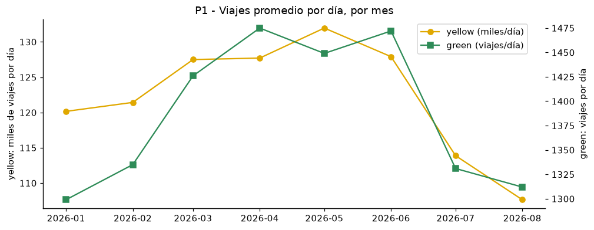
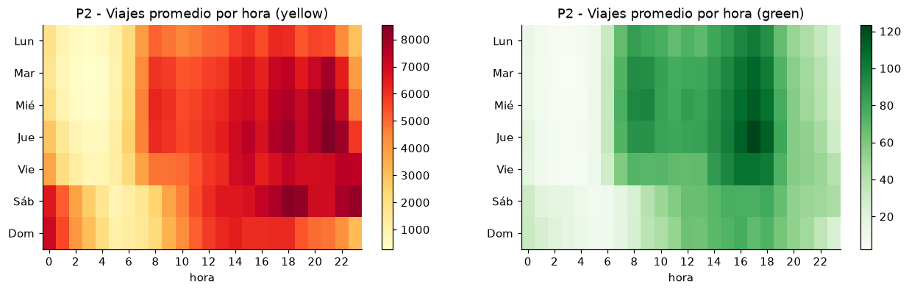
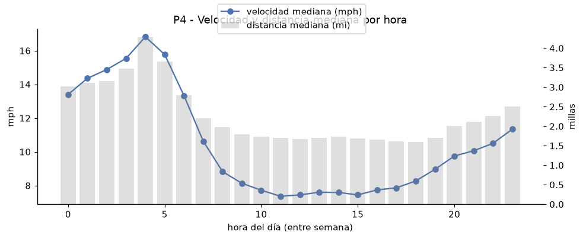
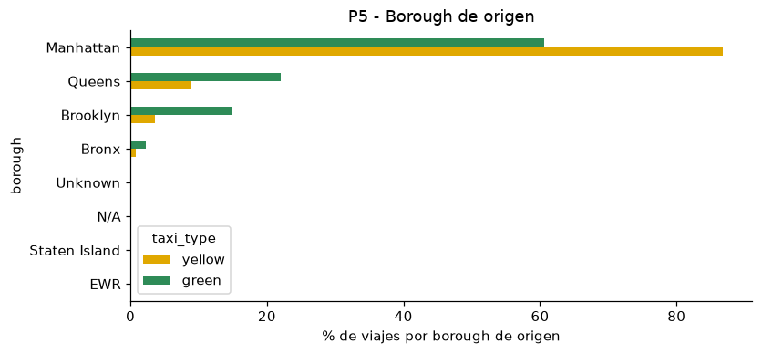
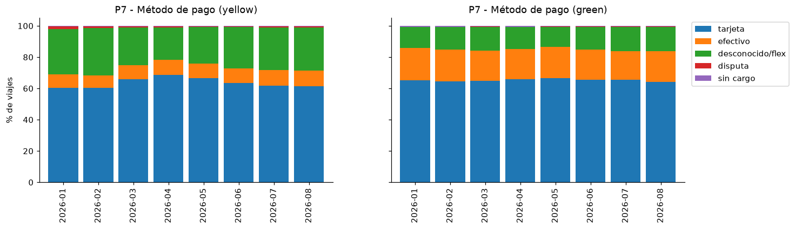
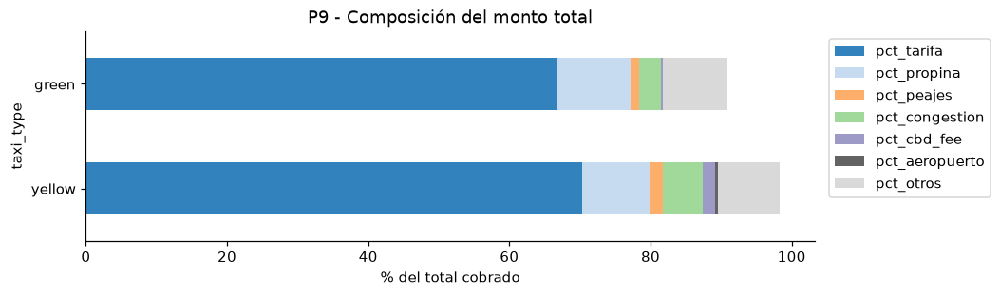
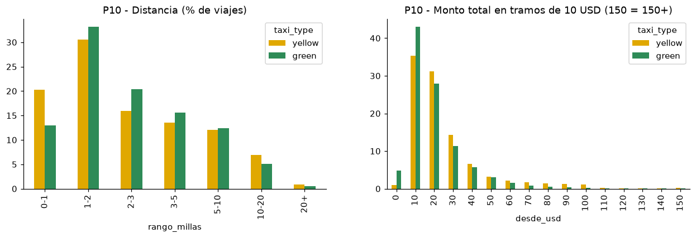

# Ejercicio 4 - Análisis exploratorio con DuckDB

- **SQL:** [`sql/04_eda.sql`](../sql/04_eda.sql) (19 consultas, cada una con `-- pregunta` y `-- objetivo`).
- **Resultados completos de 2026** (SQL + resultado + tiempo): [`docs/resultados/04_eda_2026.md`](resultados/04_eda_2026.md).
- **Notebook con gráficas:** [`notebooks/02_eda.ipynb`](../notebooks/02_eda.ipynb).
- **Reproducir:** `docker exec lab8-lab python scripts/run_sql.py sql/04_eda.sql`

> Período analizado en este ejercicio: enero-agosto 2026 (30.0 M viajes). Distribuciones sobre
> `trips_clean` (28.2 M viajes válidos), volúmenes sobre `trips`.

## 4.1 Preguntas planteadas y justificación

Las preguntas se derivaron de lo observado en el Ejercicio 3: las columnas disponibles (fechas,
distancia, zonas, montos desglosados, método de pago), la diferencia de tamaño y esquema entre
yellow y green, y los problemas de calidad detectados.

| # | Dimensión | Pregunta | Justificación | Consultas |
|---|---|---|---|---|
| P1 | Temporal | ¿Cómo evoluciona el volumen mensual de cada tipo? | Base para detectar estacionalidad y tendencias; se normaliza por días del mes | `q4_01` |
| P2 | Temporal | ¿En qué horas/días se concentra la demanda? ¿Cambia el viaje en fin de semana? | `pickup_datetime` permite ver patrones de movilidad (trabajo vs ocio) | `q4_02`, `q4_03`, `q4_18` |
| P3 | Características | ¿Cómo es un viaje típico? | Distancia/duración tienen colas largas; se usan percentiles en lugar de promedios | `q4_04`, `q4_06` |
| P4 | Características | ¿Cómo cambia la velocidad durante el día? | Distancia/duración = proxy de congestión | `q4_05` |
| P5 | Yellow vs green | ¿Dónde se originan los viajes de cada tipo? | Los taxis verdes fueron creados para dar servicio fuera del centro de Manhattan | `q4_07`, `q4_08` |
| P6 | Yellow vs green | ¿En qué se diferencian económicamente? | Comparar con promedios/medianas, porque green es ~90 veces más pequeño | `q4_09` |
| P7 | Pago | ¿Cómo se distribuyen los métodos de pago en el tiempo? | 26% de yellow tiene `payment_type = 0` | `q4_10` |
| P8 | Pago | ¿Qué propina se deja según el método de pago? | `tip_amount` solo se registra en algunos métodos | `q4_11` |
| P9 | Pago | ¿Qué compone el monto total? | Hay 9 componentes de cobro (incluyendo la nueva `cbd_congestion_fee`) | `q4_12` |
| P10 | Distribuciones | ¿Cómo se distribuyen distancia y total? | Ver forma, sesgo y colas | `q4_13`, `q4_14` |
| P11 | Atípicos | ¿Qué atípicos e inconsistencias persisten tras la limpieza? | Validar las reglas de `trips_clean` y la coherencia de los montos | `q4_15`, `q4_16`, `q4_19` |
| P12 | Características | ¿Qué peso tienen los viajes de aeropuerto? | JFK aparece entre las zonas principales | `q4_17` |

## 4.2 / 4.3 Consultas

Cada consulta está en `sql/04_eda.sql` con su pregunta y objetivo, y el reporte generado incluye el SQL
exacto ejecutado y su resultado. Técnicas de DuckDB utilizadas: `GROUP BY ALL`, `FILTER (WHERE ...)`,
funciones de ventana (`sum(...) OVER (PARTITION BY ...)`, `row_number()`), `quantile_cont` con lista de
cuantiles, `median`, `arg_max/arg_min`, `isodow`, `UNPIVOT`, y un `JOIN` entre Parquet y CSV (zonas).

## 4.4 Resultados

### P1 - Volumen mensual (`q4_01`)

| | ene | feb | mar | abr | may | jun | jul | ago |
|---|---:|---:|---:|---:|---:|---:|---:|---:|
| yellow (viajes/día) | 120,158 | 121,424 | 127,498 | 127,708 | **131,962** | 127,908 | 113,874 | 107,636 |
| green (viajes/día) | 1,299 | 1,335 | 1,426 | **1,475** | 1,449 | 1,472 | 1,331 | 1,312 |

La demanda sube de enero a mayo (pico de primavera) y cae en julio-agosto (vacaciones de verano):
yellow pierde 18% de viajes diarios entre mayo y agosto. Yellow genera ~100-125 M USD por mes; green ~1 M.

### P2 - Hora y día (`q4_02`, `q4_03`, `q4_18`)

- **Yellow** tiene su pico entre semana a las **21 h** (6.6% de los viajes del día) y la noche del
  sábado/madrugada del domingo es muy activa: es un servicio de ocio/vida nocturna además de trabajo.
- **Green** tiene un patrón de **commute**: pico a las **17 h** entre semana (8.1%), mañanas activas
  desde las 7 h y fines de semana mucho más tranquilos (1,033 vs 1,371 viajes por día).
- En fin de semana los viajes son más largos (3.66 vs 3.50 mi), más rápidos (12.0 vs 10.5 mph) y con
  menor propina (11.8% vs 14.4% de la tarifa).

### P3 / P4 - Viaje típico y velocidad (`q4_04`, `q4_05`, `q4_06`)

| | distancia mediana | distancia p95 | duración mediana | duración p95 | velocidad prom. | pasajeros prom. | total prom. |
|---|---:|---:|---:|---:|---:|---:|---:|
| yellow | 1.95 mi | 12.64 mi | 14.2 min | 44.1 min | 10.9 mph | 1.25 | 30.18 USD |
| green | 2.15 mi | 10.48 mi | 13.3 min | 43.0 min | 11.4 mph | 1.32 | 25.32 USD |

- El viaje típico es **corto**: la mitad mide menos de 2 millas y dura ~14 minutos; el promedio
  (3.55 mi) es casi el doble de la mediana por la cola de viajes largos (aeropuertos).
- La velocidad mediana cae de **16.8 mph a las 4 h** a **7.4 mph a las 11-15 h**; como de día los
  viajes son más cortos (1.6-1.7 mi), la duración mediana se mantiene casi constante (~13-16 min).
- 60.8% de los viajes amarillos y 70.7% de los verdes son de **1 pasajero**.

### P5 / P6 - Yellow vs green (`q4_07`, `q4_08`, `q4_09`)

| | Manhattan | Queens | Brooklyn | Bronx | tarifa prom. | USD/milla (mediana) | propina prom. | aeropuerto | tarifa negociada | despacho |
|---|---:|---:|---:|---:|---:|---:|---:|---:|---:|---:|
| yellow | **86.7%** | 8.8% | 3.6% | 0.8% | 21.22 | 7.52 | 2.89 | 8.2% de viajes | 0.4% | – |
| green | **60.6%** | 22.0% | 15.0% | 2.3% | 16.90 | 6.68 | 2.64 | 3.4% de viajes | 3.1% | 2.6% |

- Las principales zonas yellow son Upper East Side, Midtown y **JFK Airport** (3er lugar, 4% de los viajes).
- Green se concentra en **East Harlem North (27.6%) y South (13.4%)**: 41% de sus viajes nace en dos
  zonas del norte de Manhattan, fuera de la zona de exclusión del taxi amarillo.
- Green es más barato por viaje y por milla, paga menos recargo de congestión (0.80 vs 1.70 USD) y casi
  no paga la nueva cuota CBD (0.06 vs 0.54 USD), porque opera fuera del distrito central.

### P7 / P8 / P9 - Pago (`q4_10`, `q4_11`, `q4_12`)

- Yellow: **tarjeta 60-69%**, desconocido/flex **21-30%**, efectivo 8-10%. Green: tarjeta ~65%,
  **efectivo ~20%** (el doble que yellow) y desconocido ~14%.
- **Propina:** con tarjeta, 91% de los viajes deja propina y equivale al **21.6%** de la tarifa
  (yellow) / 21.2% (green). En efectivo la propina registrada es **0%**: no se captura, no es que no exista.
- **Composición del total** (yellow): tarifa 70.3%, propina 9.6%, congestión 5.6%, CBD 1.8%, peajes 1.8%,
  otros 8.7%.

### P10 - Distribuciones (`q4_13`, `q4_14`)

Ambas distribuciones son **asimétricas a la derecha**: 51% de los viajes amarillos mide menos de 2 millas
y 66% paga entre 10 y 30 USD, pero la cola es pesada: entre 60 y 110 USD hay una meseta (~1.1-2.2% por tramo)
que corresponde a la tarifa fija de JFK y a viajes de aeropuerto.

### P11 - Atípicos e inconsistencias (`q4_15`, `q4_16`, `q4_19`)

| | límite IQR distancia | % atípicos | límite IQR duración | % atípicos | límite IQR total | % atípicos |
|---|---:|---:|---:|---:|---:|---:|
| yellow | 8.33 mi | 10.8% | 42.7 min | 5.4% | 59.77 USD | 8.5% |
| green | 7.37 mi | 10.1% | 37.9 min | 6.8% | 51.25 USD | 6.6% |

- El criterio IQR marca ~10% de los viajes como atípicos en distancia: **no son errores** sino viajes
  largos legítimos (aeropuertos). Por eso `trips_clean` usa límites físicos (≤100 mi, ≤3 h) y no IQR.
- **36.7% de los totales amarillos no cuadra** con la suma de sus componentes (`q4_16`). `q4_19` muestra
  que es **sistemático por proveedor**: el proveedor 1 registra −3.25 USD (incluye congestión 2.50 +
  CBD 0.75 dentro de `extra`, por lo que se suman dos veces) y los viajes flex del proveedor 2 cobran
  +2.50 USD de congestión sin registrarla en `congestion_surcharge`.
- 7,987 viajes amarillos tienen velocidades > 80 mph (errores de GPS/reloj).

### P12 - Aeropuertos (`q4_17`)

Solo **8.2%** de los viajes amarillos toca JFK, LaGuardia o Newark, pero generan **21.1% de los
ingresos** (total promedio 77.96 USD vs 25.94 USD del resto; 13.1 mi vs 2.7 mi).

## 4.5 Hallazgos relevantes

1. **Dos servicios con mercados distintos.** Yellow es un servicio de Manhattan (86.7%) con fuerte
   componente aeroportuario (8% de viajes, 21% de ingresos) y nocturno (pico a las 21 h, sábados
   noche). Green es un servicio de barrio/commute: 41% de sus viajes nace en East Harlem, su pico es a
   las 17 h y cae en fin de semana. Comparar totales absolutos no tiene sentido (yellow es ~90×); hay
   que comparar proporciones.
2. **La congestión domina el día.** La velocidad mediana se reduce a menos de la mitad entre la
   madrugada (16.8 mph) y el mediodía (7.4 mph). La duración del viaje casi no cambia porque la gente
   hace viajes más cortos en horas congestionadas.
3. **Los datos de pago no son homogéneos y requieren cuidado.** 26% de los viajes amarillos son
   flex/desconocido sin datos del taxímetro, la propina en efectivo no se registra (el 21.6% de propina
   solo aplica a tarjeta) y el desglose de cargos depende del proveedor (36.7% de totales no cuadran).
   Cualquier indicador de ingresos o propinas debe usar `total_amount` y filtrar por método de pago.
4. **Estacionalidad:** mayo es el mes de mayor demanda y julio-agosto caen ~18%.
