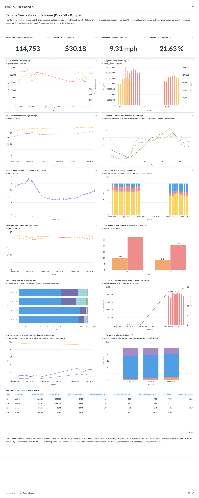

# Ejercicio 7 - Indicadores y tablero

- **SQL de los indicadores (7.3, 7.7):** [`sql/07_indicadores.sql`](../sql/07_indicadores.sql) — cada consulta `ind_*`
  incluye `pregunta`, `objetivo`, `justificacion` y `visualizacion`.
- **Resultados de cada indicador:** [`docs/resultados/07_indicadores_2024_2026.md`](resultados/07_indicadores_2024_2026.md)
- **Construcción del tablero (7.4, 7.5):** [`scripts/setup_metabase.py`](../scripts/setup_metabase.py) crea en Metabase
  la conexión DuckDB, una pregunta por indicador y el tablero completo, de forma reproducible.
- **Evidencia del tablero:** [`docs/dashboard/tablero_2024_2026.png`](dashboard/tablero_2024_2026.png)
  (versión final con 3 años en el Ejercicio 8).

```bash
docker exec lab8-lab python scripts/build_db.py          # materializa trips + tablas ind_*
docker exec lab8-lab python scripts/setup_metabase.py    # crea/actualiza el tablero en Metabase
# abrir http://127.0.0.1:3000 (credenciales locales en data/processed/metabase_admin.json)
# o el enlace publico que imprime el script
```

## Arquitectura

```text
data/raw/*.parquet ──(sql/00_vistas.sql)──> vistas trips / trips_clean
        │
        └─ build_db.py ─> data/processed/taxi.duckdb
                              ├─ trips (tabla, 72-120 M filas), zones, trips_clean (vista)
                              └─ ind_* (12 tablas pequeñas, sql/07_indicadores.sql)
                                       │
                         Metabase (driver DuckDB, read_only) ─> tablero "Taxis NYC - Indicadores"
```

Se materializan los indicadores como tablas pequeñas (40-160 filas) porque el tablero repite las mismas
consultas en cada visita: según el Ejercicio 6 esto es el escenario donde materializar conviene. Metabase
se conecta en **modo solo lectura**, para no bloquear el archivo `.duckdb` (un solo escritor a la vez).

## 7.1 Preguntas de análisis (13)

| # | Pregunta |
|---|---|
| Q1 | ¿Cómo evoluciona la demanda (viajes por día) de cada tipo de taxi mes a mes? |
| Q2 | ¿Cuánto ingreso genera cada servicio por mes? |
| Q3 | ¿Cuánto paga en promedio un pasajero por viaje y por milla, y cómo cambia? |
| Q4 | ¿En qué horas se concentra la demanda entre semana y en fin de semana? |
| Q5 | ¿Qué tan congestionado está el tráfico a cada hora y cómo cambió entre años? |
| Q6 | ¿Cómo pagan los pasajeros y está desapareciendo el efectivo? |
| Q7 | ¿Cuánta propina dejan quienes pagan con tarjeta y cómo evoluciona? |
| Q8 | ¿Qué peso tienen los aeropuertos en la demanda y en los ingresos? |
| Q9 | ¿Dónde se originan los viajes de cada tipo de taxi y está cambiando? |
| Q10 | ¿Cuántos viajes pagan la cuota de congestión de Manhattan (CBD) y cuánto recauda? |
| Q11 | ¿Qué tan confiables son los datos de cada mes? |
| Q12 | ¿Qué proporción de viajes se solicita por plataformas (Uber/Lyft)? |
| Q13 | ¿Cómo se comparan los años en sus métricas principales (mismos meses)? |

## 7.2 / 7.6 Indicadores y justificación

| Indicador | Tabla / consulta | Preguntas | Visualización | Justificación |
|---|---|---|---|---|
| **I1** Viajes por día e ingresos mensuales | `ind_demanda_mensual` | Q1, Q2 | líneas / barras, green en eje derecho | Volumen base del negocio; normalizado por días del mes para comparar meses y años |
| **I2** Ingreso promedio por viaje y USD/milla | `ind_ingreso_por_viaje` | Q3 | líneas | Precio efectivo pagado; separa tarifas de distancia |
| **I3** Distribución horaria (% del día) | `ind_demanda_horaria` | Q4 | líneas por hora | Dimensionar oferta por franja; distingue uso laboral vs ocio |
| **I4** Velocidad mediana por hora | `ind_velocidad_horaria` | Q5 | líneas por año | Proxy de congestión; permite evaluar políticas como la cuota CBD |
| **I5** Mezcla de métodos de pago | `ind_mix_pago` | Q6 | barras apiladas | Digitalización y calidad del registro (flex/desconocido) |
| **I6** Propina con tarjeta (% de la tarifa) | `ind_propina_tarjeta` | Q7 | líneas | Ingreso del conductor; solo tarjeta registra propina (EDA P8) |
| **I7** % viajes vs % ingresos de aeropuerto | `ind_aeropuertos` | Q8 | barras agrupadas | Segmento pequeño en viajes pero grande en ingresos |
| **I8** Borough de origen | `ind_borough_origen` | Q9 | barras horizontales apiladas | Verifica el rol de cada servicio (green fuera del centro) |
| **I9** Cuota de congestión CBD | `ind_cuota_congestion` | Q10 | combo barras (USD) + línea (%) | Cambio regulatorio más importante del período (ene-2025) |
| **I10** Calidad del dato | `ind_calidad_datos` | Q11 | líneas | Contexto para interpretar los demás indicadores |
| **I11** Origen de la solicitud | `ind_plataformas` | Q12 | barras apiladas | Tendencia nueva (2026): taxis despachados por apps |
| **KPIs + tabla resumen** | `ind_resumen_anual` | Q13 | número + tabla | Comparación anual en el mismo período (ene-ago) |

Todas las tablas se agrupan por `file_year`/`file_month`, sin años fijos, por lo que el tablero se actualiza
solo al incorporar nuevos años (Ejercicio 8).

## 7.4 / 7.5 Tablero



Organización: encabezado con la fuente → 4 KPI del último año (ene-ago) → volumen e ingresos → precio y
patrón horario → congestión y pagos → propinas y aeropuertos → geografía y cuota CBD → calidad y
plataformas → tabla resumen comparable → nota de lectura. Así se leen juntos volumen, precio, tiempo,
espacio y calidad.

## 7.8 Interpretación (con 2024 + 2026)

| Indicador | Resultado | Interpretación |
|---|---|---|
| I1 | yellow ene-ago: 102,980 → **114,753** viajes/día (+11.4%); green: 1,671 → **1,273** (−23.8%) | El amarillo se recuperó; el verde sigue perdiendo demanda frente a las apps |
| I2 | yellow: 28.33 → **30.18** USD por viaje (+6.5%); tarifa base 19.51 → 21.22; USD/milla mediana 7.23 → 7.52; green: 23.74 → 25.32 | El aumento viene sobre todo de la tarifa: viajes más largos (distancia mediana 1.80 → 1.95 mi) y +4% por milla; la cuota CBD suma ~0.54 USD promedio |
| I3 | pico entre semana: yellow 18 h (7.0% del día), green 17 h (8.4%); fin de semana ambos a las 18 h y con más actividad nocturna | Green responde al commute; yellow mantiene demanda alta hasta las 22 h |
| I4 | velocidad mediana entre semana 7.3-7.5 mph a las 11-15 h; 2026 ligeramente más lenta en horas valle | La congestión de mediodía no mejoró en 2026 respecto a 2024 |
| I5 | yellow tarjeta: **76.0% → 65.7%**; desconocido/flex 9.9% → 26.0% | No es que se use menos tarjeta: crece la categoría sin datos del taxímetro |
| I6 | propina con tarjeta ~21-22% de la tarifa (yellow 22.15% → 21.63%) | Muy estable; leve baja coherente con precios más altos |
| I7 | aeropuertos: 10.1% de viajes y **27.9%** de ingresos en 2024; 8.2% y 21.1% en 2026 | Segmento clave, pero pierde peso (competencia de apps en traslados al aeropuerto) |
| I8 | green: ~61% Manhattan, 22-24% Queens; yellow: 87-89% Manhattan; yellow en Brooklyn 1.4% → 3.6% | Yellow se expande fuera de Manhattan; green mantiene su perfil |
| I9 | 0 en 2024; en 2026 **66-77%** de los viajes yellow pagan cuota CBD; 1.78-2.11 M USD al mes | Efecto directo de la política de 2025 sobre el precio |
| I10 | 91-96% de registros válidos cada mes; sin datos de taxímetro (yellow) crece de 4.7-13.3% (2024) a **20.9-30.1%** (2026) | La calidad de los datos de pago se deterioró: hay que leer I5/I6 con cuidado |
| I11 | jun-ago 2026: **18-24%** de viajes yellow pedidos por Uber, 5.4% por Lyft (ago) | Integración de taxis amarillos en plataformas de alto volumen |

### Principales hallazgos

1. **Divergencia yellow/green:** el taxi amarillo creció 11% en viajes diarios mientras el verde cayó 24%.
2. **Encarecimiento del viaje:** +1.85 USD por viaje en yellow, por viajes más largos y más caros por milla (I2)
   y por la nueva cuota CBD (I9), que pagan 2 de cada 3 a 3 de cada 4 viajes amarillos.
3. **Taxis en plataformas:** desde junio 2026 1 de cada 4 viajes amarillos llega por Uber/Lyft (I11), lo que
   coincide con el crecimiento de viajes sin datos de taxímetro (I10, I5).
4. **Los aeropuertos pierden participación** (27.9% → 21.1% de los ingresos amarillos).
