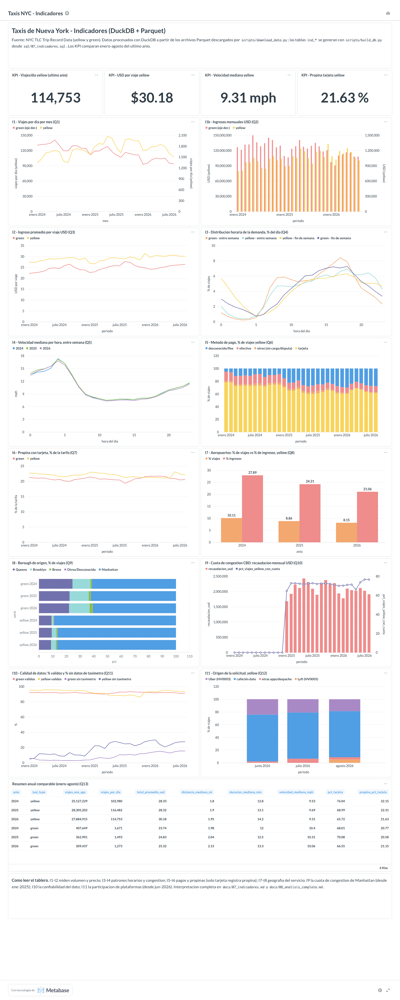
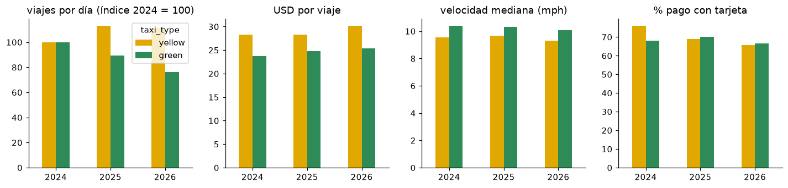
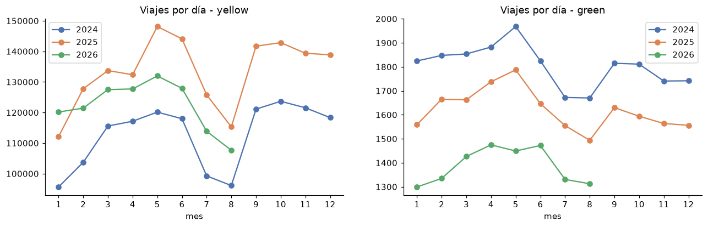
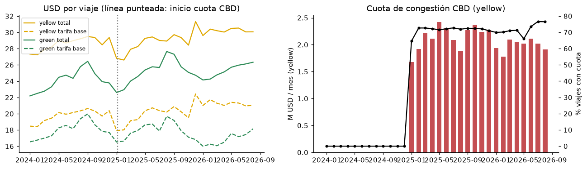
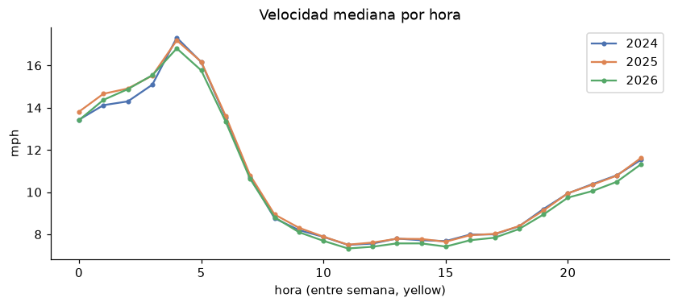
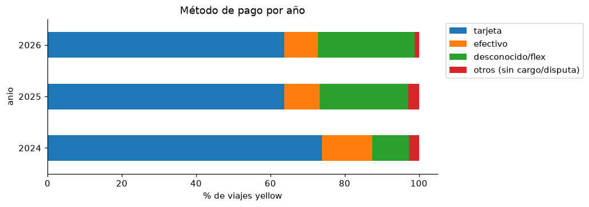

# Ejercicio 8 - Incorporación de 2025 y análisis completo (2024-2026)

- **SQL:** [`sql/08_validacion_2025.sql`](../sql/08_validacion_2025.sql) (validación + evolución) → [`resultados/08_validacion_2025.md`](resultados/08_validacion_2025.md)
- **Consultas anteriores re-ejecutadas sobre 3 años:** [`03_exploracion_3anios.md`](resultados/03_exploracion_3anios.md),
  [`04_eda_3anios.md`](resultados/04_eda_3anios.md), [`05_validacion_2024_3anios.md`](resultados/05_validacion_2024_3anios.md),
  [`07_indicadores_3anios.md`](resultados/07_indicadores_3anios.md)
- **Benchmark con 3 años:** [`resultados/06_benchmark.md`](resultados/06_benchmark.md)
- **Notebooks:** [`03_incorporacion_anios.ipynb`](../notebooks/03_incorporacion_anios.ipynb), [`05_indicadores_evolucion.ipynb`](../notebooks/05_indicadores_evolucion.ipynb)
- **Tablero final:** [`dashboard/tablero_final_2024_2025_2026.png`](dashboard/tablero_final_2024_2025_2026.png)

## 8.1 / 8.2 Descarga de 2025

Nuevamente un cambio de una línea:

```diff
-ANIOS = (2024, 2026)
+ANIOS = (2024, 2025, 2026)
```

```text
RESUMEN  (anios: 2024, 2025, 2026)
  descargados   : 24      <- solo 2025 (12 yellow + 12 green)
  ya existian   : 40      <- 2024 y 2026 no se volvieron a descargar
  no publicados : 8       <- sep-dic 2026
  fallidos      : 0
```

`--verificar`: 64/64 archivos con el tamaño del servidor. `verify_data.py`: 64 archivos, 0 ilegibles,
0 meses faltantes, **121,184,384** filas.

| tipo | 2024 | 2025 | 2026 (ene-ago) |
|---|---:|---:|---:|
| yellow | 41,169,720 | 48,722,602 | 29,703,355 |
| green | 660,218 | 591,375 | 337,114 |

## 8.3 ¿Siguen funcionando las consultas?

**Sí, sin modificar el SQL de análisis.** Se re-ejecutaron las 16 consultas del Ej. 3, las 19 del Ej. 4,
las 8 del Ej. 5 y los 12 indicadores del Ej. 7 sobre los 3 años (reportes `*_3anios.md`), y `q8_02`
confirma que las vistas leen exactamente las filas de los metadatos para los 6 grupos tipo-año. El
esquema de 2025 ya trae `cbd_congestion_fee` (`q8_04`), que antes solo existía en 2026.

Lo que sí hubo que ajustar fue **operativo, no de SQL**, al pasar de 72 M a 121 M de filas:

| Problema | Causa | Cambio |
|---|---|---|
| `build_db.py` terminaba con *exit 137* (OOM) | con 10 hilos los buffers de lectura de Parquet por hilo no cuentan en `memory_limit`; y los indicadores con `median` sobre la tabla sin comprimir acumulaban todos los valores | `memory_limit = 3GB`, `threads = 4`, `preserve_insertion_order = false`, `temp_directory`; los indicadores se calculan desde las vistas Parquet en una conexión nueva |
| Metabase seguía mostrando datos anteriores | mantiene abierto el archivo `.duckdb` reemplazado | `docker compose restart metabase` antes de `setup_metabase.py` |
| Benchmark con 3 años | mismo límite de memoria | `--hilos 4 --memoria 3GB` para ambas estrategias |

## 8.4 Indicadores y visualizaciones actualizados

`build_db.py` regeneró las tablas `ind_*` con los 3 años (76 s en total) y `setup_metabase.py` actualizó
el tablero: las series ahora cubren ene-2024 a ago-2026 (64 períodos por tipo de taxi en I1) y la tabla
resumen tiene 6 filas.



## 8.5 Evolución de los indicadores (mismo período ene-ago, `q8_06` / `ind_resumen_anual`)

| tipo | año | viajes/día | USD/viaje | tarifa base | cuota CBD prom. | distancia med. | duración med. | velocidad med. | % tarjeta | % efectivo |
|---|---|---:|---:|---:|---:|---:|---:|---:|---:|---:|
| yellow | 2024 | 102,980 | 28.33 | 19.53 | 0.00 | 1.80 mi | 12.8 min | 9.53 mph | 76.0 | 13.7 |
| yellow | 2025 | **116,482** | 28.32 | 19.55 | 0.55 | 1.90 | 13.1 | 9.69 | 69.0 | 9.9 |
| yellow | 2026 | 114,753 | **30.18** | **21.22** | 0.54 | 1.95 | 14.2 | 9.31 | 65.7 | 9.0 |
| green | 2024 | 1,671 | 23.74 | 17.72 | 0.00 | 1.98 | 12.0 | 10.40 | 68.0 | 27.6 |
| green | 2025 | 1,493 | 24.83 | 17.96 | 0.07 | 2.04 | 12.5 | 10.31 | 70.1 | 23.1 |
| green | 2026 | **1,273** | 25.32 | 16.90 | 0.06 | 2.15 | 13.3 | 10.06 | 66.6 | 19.5 |




Variación interanual de viajes/día por mes (`q8_08`): yellow **+13% a +27%** en cada mes de 2025 vs 2024;
en 2026 vs 2025 sube en enero (+7.2%) y cae en todos los demás meses (−3.5% a −11.2%). Green cae **todos
los meses** de ambos años (−7% a −15% en 2025 y −11% a −20% en 2026).





Otros indicadores a través del tiempo:

| Indicador | 2024 | 2025 | 2026 |
|---|---:|---:|---:|
| I7 aeropuertos: % de viajes / % de ingresos (yellow) | 10.1% / 27.9% | 8.9% / 24.2% | 8.2% / 21.1% |
| I8 yellow con origen en Brooklyn | 1.4% | 3.3% | 3.6% |
| I9 cuota CBD recaudada por yellow | 0 | 25.8 M USD (71.6% de viajes) | 15.9 M USD en 8 meses (71.9%) |
| I6 propina con tarjeta (yellow, % de la tarifa) | 22.1% | 22.0% | 21.7% |
| I10 yellow sin datos de taxímetro | 9.9% | 23.8% | 26.0% |
| I10 yellow conservado en `trips_clean` | 95.0% | **89.4%** | 93.9% |
| Ingresos totales yellow (año calendario) | 1,146 M USD | 1,311 M USD | 893 M USD (ene-ago) |

## 8.6 Cambios y patrones visibles al considerar 2024, 2025 y 2026

1. **2025 fue un año de expansión del taxi amarillo, 2026 de estancamiento.** Los viajes diarios crecieron
   13% (ene-ago) y los ingresos anuales pasaron de 1,146 a 1,311 M USD; en 2026 la demanda baja 1.5% frente
   a 2025 pero sigue 11% por encima de 2024. Con un solo año esto parecía "crecimiento" (2024→2026) o
   "caída" (2025→2026); los tres años muestran un pico en 2025.
2. **El taxi verde está en declive estructural.** Pierde viajes todos los meses de los dos años
   (1,671 → 1,493 → 1,273 viajes/día, −24% en dos años), aunque su perfil geográfico no cambia (~61%
   Manhattan, 22-24% Queens). No es estacionalidad: es una tendencia sostenida.
3. **La cuota de congestión cambió el precio, pero no la velocidad.** Desde enero 2025 ~72% de los viajes
   amarillos paga la cuota (0.55 USD promedio, 25.8 M USD en 2025). El total por viaje se mantuvo en 2025
   (28.33 → 28.32) y subió en 2026 (30.18) por la **tarifa base** (+8.5%), no por la cuota. La velocidad
   mediana de los viajes dentro de la zona CBD entre semana de 7 a 19 h (`q8_07`) no mejoró:
   8.35 → 8.34 → **7.94 mph**, y la duración mediana subió de 13.2 a 14.2 min.
4. **Cambio en la forma de pagar y de registrar.** El pago con tarjeta baja (76% → 69% → 66%) y el efectivo
   también (13.7% → 9.0%), mientras crecen los viajes "flex"/sin datos de taxímetro (9.9% → 26.0%), que
   desde junio 2026 coinciden con viajes solicitados por Uber/Lyft (18-24% de los amarillos, I11).
5. **Los aeropuertos pierden peso** de forma continua (27.9% → 24.2% → 21.1% de los ingresos amarillos),
   y el amarillo gana presencia en Brooklyn (1.4% → 3.6% de los orígenes).
6. **La calidad del dato varía por año:** 2025 tiene más registros inválidos (89.4% conservado) porque 5.9%
   de los viajes amarillos tiene `fare_amount ≤ 0` (vs 1.8% en 2024 y 0.6% en 2026), lo que coincide con la
   transición de cobro de la cuota CBD y los viajes flex. Esto confirma que las reglas de limpieza deben
   validarse cada vez que se incorpora un año.

## 8.7 Consultas utilizadas

`sql/08_validacion_2025.sql`: `q8_01` archivos por año, `q8_02` metadatos vs vista, `q8_03` cobertura
mensual de los 3 años, `q8_04` esquema por año, `q8_05` calidad por año, `q8_06` evolución anual en el
mismo período, `q8_07` velocidad en la zona CBD, `q8_08` variación interanual por mes. Indicadores
actualizados: `sql/07_indicadores.sql` (sin cambios). Todas documentadas con objetivo, fuente y decisión
en el archivo y en el reporte generado.
