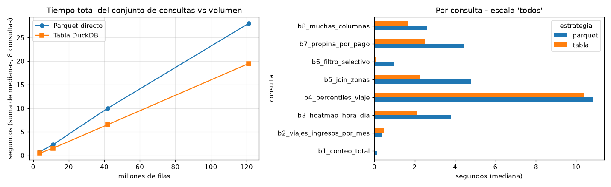
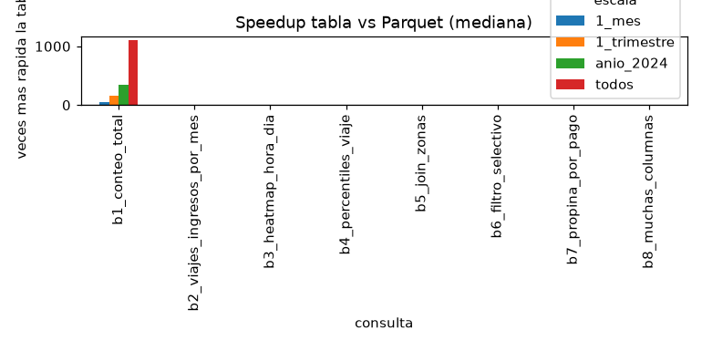

# Resultados del benchmark Parquet vs tabla DuckDB

Generado con `python scripts/benchmark.py --repeticiones 5` el 2026-10-07 02:36. DuckDB con 4 hilos. `primera_s` = primera ejecucion en una conexion nueva; `mediana_s` = mediana de las 5 repeticiones siguientes. `speedup` = mediana Parquet / mediana tabla.

## Costo de materializar (por escala)

| escala | archivos | filas | parquet_mib | tabla_mib | carga_s |
|---|---|---|---|---|---|
| 1_mes | 2 | 3,765,161 | 62.1 | 127.8 | 1.16 |
| 1_trimestre | 6 | 11,199,059 | 184.8 | 386.3 | 2.6 |
| anio_2024 | 24 | 41,829,938 | 676.1 | 1,452 | 10.65 |
| todos | 64 | 121,184,384 | 1,977 | 4,184.8 | 31.59 |

## Tiempo por consulta, escala y estrategia

| escala | filas | consulta | parquet_primera_s | parquet_mediana_s | tabla_primera_s | tabla_mediana_s | speedup |
|---|---|---|---|---|---|---|---|
| 1_mes | 3,765,161 | b1_conteo_total | 0.0044 | 0.0029 | 0.0004 | 0.0001 | 29 |
| 1_mes | 3,765,161 | b2_viajes_ingresos_por_mes | 0.0107 | 0.0101 | 0.0217 | 0.0174 | 0.58 |
| 1_mes | 3,765,161 | b3_heatmap_hora_dia | 0.1015 | 0.1097 | 0.0849 | 0.0689 | 1.59 |
| 1_mes | 3,765,161 | b4_percentiles_viaje | 0.271 | 0.2594 | 0.2083 | 0.186 | 1.39 |
| 1_mes | 3,765,161 | b5_join_zonas | 0.1316 | 0.1461 | 0.0924 | 0.069 | 2.12 |
| 1_mes | 3,765,161 | b6_filtro_selectivo | 0.0278 | 0.0297 | 0.0143 | 0.0035 | 8.49 |
| 1_mes | 3,765,161 | b7_propina_por_pago | 0.1298 | 0.1418 | 0.0966 | 0.0752 | 1.89 |
| 1_mes | 3,765,161 | b8_muchas_columnas | 0.0889 | 0.085 | 0.0729 | 0.0504 | 1.69 |
| 1_trimestre | 11,199,059 | b1_conteo_total | 0.011 | 0.01 | 0.0007 | 0.0001 | 100 |
| 1_trimestre | 11,199,059 | b2_viajes_ingresos_por_mes | 0.0312 | 0.0312 | 0.0526 | 0.0421 | 0.74 |
| 1_trimestre | 11,199,059 | b3_heatmap_hora_dia | 0.3198 | 0.3246 | 0.2603 | 0.1832 | 1.77 |
| 1_trimestre | 11,199,059 | b4_percentiles_viaje | 0.9391 | 0.8615 | 0.7967 | 0.7315 | 1.18 |
| 1_trimestre | 11,199,059 | b5_join_zonas | 0.3295 | 0.3844 | 0.2671 | 0.1838 | 2.09 |
| 1_trimestre | 11,199,059 | b6_filtro_selectivo | 0.0742 | 0.0733 | 0.0423 | 0.0086 | 8.52 |
| 1_trimestre | 11,199,059 | b7_propina_por_pago | 0.3716 | 0.3662 | 0.2689 | 0.2108 | 1.74 |
| 1_trimestre | 11,199,059 | b8_muchas_columnas | 0.239 | 0.2322 | 0.219 | 0.1658 | 1.4 |
| anio_2024 | 41,829,938 | b1_conteo_total | 0.0477 | 0.0413 | 0.0014 | 0.0001 | 413 |
| anio_2024 | 41,829,938 | b2_viajes_ingresos_por_mes | 0.132 | 0.1303 | 0.2906 | 0.1702 | 0.77 |
| anio_2024 | 41,829,938 | b3_heatmap_hora_dia | 1.4026 | 1.2898 | 1.5108 | 0.7307 | 1.77 |
| anio_2024 | 41,829,938 | b4_percentiles_viaje | 4.3243 | 4.1444 | 4.3851 | 3.3467 | 1.24 |
| anio_2024 | 41,829,938 | b5_join_zonas | 1.5921 | 1.5342 | 1.5124 | 0.7806 | 1.97 |
| anio_2024 | 41,829,938 | b6_filtro_selectivo | 0.3606 | 0.3186 | 0.2764 | 0.0323 | 9.86 |
| anio_2024 | 41,829,938 | b7_propina_por_pago | 1.6168 | 1.5353 | 1.4435 | 0.8699 | 1.76 |
| anio_2024 | 41,829,938 | b8_muchas_columnas | 0.9905 | 0.9839 | 1.0481 | 0.5715 | 1.72 |
| todos | 121,184,384 | b1_conteo_total | 0.1336 | 0.1245 | 0.0035 | 0.0001 | 1,245 |
| todos | 121,184,384 | b2_viajes_ingresos_por_mes | 0.4036 | 0.3988 | 0.7822 | 0.4741 | 0.84 |
| todos | 121,184,384 | b3_heatmap_hora_dia | 3.9261 | 3.7879 | 4.6161 | 2.111 | 1.79 |
| todos | 121,184,384 | b4_percentiles_viaje | 11.4547 | 10.8354 | 13.7775 | 10.3904 | 1.04 |
| todos | 121,184,384 | b5_join_zonas | 5.5642 | 4.786 | 6.11 | 2.2402 | 2.14 |
| todos | 121,184,384 | b6_filtro_selectivo | 1.4679 | 0.9754 | 1.5764 | 0.1074 | 9.08 |
| todos | 121,184,384 | b7_propina_por_pago | 5.055 | 4.4445 | 5.6054 | 2.4957 | 1.78 |
| todos | 121,184,384 | b8_muchas_columnas | 3.0131 | 2.6241 | 3.8045 | 1.6539 | 1.59 |

## Resumen por escala (suma de medianas de las 8 consultas)

| escala | filas | parquet_s | tabla_s | speedup | carga_s | ejecuciones_para_amortizar_carga |
|---|---|---|---|---|---|---|
| 1_mes | 3,765,161 | 0.785 | 0.471 | 1.67 | 1.16 | 3.7 |
| 1_trimestre | 11,199,059 | 2.283 | 1.526 | 1.5 | 2.6 | 3.4 |
| anio_2024 | 41,829,938 | 9.978 | 6.502 | 1.53 | 10.65 | 3.1 |
| todos | 121,184,384 | 27.977 | 19.473 | 1.44 | 31.59 | 3.7 |

Todas las consultas devolvieron el mismo resultado en ambas estrategias: si.

