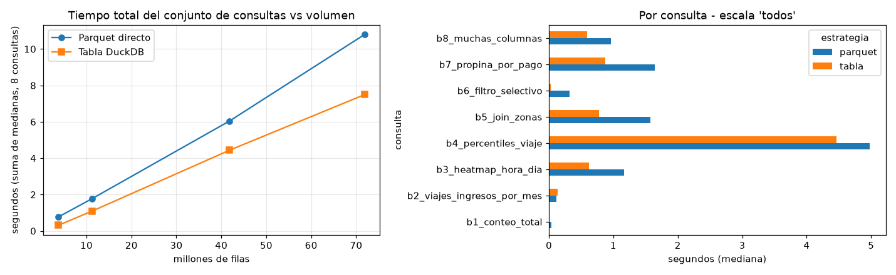

# Resultados del benchmark Parquet vs tabla DuckDB

Generado con `python scripts/benchmark.py --repeticiones 5` el 2026-10-07 02:06. DuckDB con 10 hilos. `primera_s` = primera ejecucion en una conexion nueva; `mediana_s` = mediana de las 5 repeticiones siguientes. `speedup` = mediana Parquet / mediana tabla.

## Costo de materializar (por escala)

| escala | archivos | filas | parquet_mib | tabla_mib | carga_s |
|---|---|---|---|---|---|
| 1_mes | 2 | 3,765,161 | 62.1 | 127.3 | 0.87 |
| 1_trimestre | 6 | 11,199,059 | 184.8 | 386 | 1.8 |
| anio_2024 | 24 | 41,829,938 | 676.1 | 1,406 | 6.16 |
| todos | 40 | 71,870,407 | 1,171.7 | 2,418.5 | 10.05 |

## Tiempo por consulta, escala y estrategia

| escala | filas | consulta | parquet_primera_s | parquet_mediana_s | tabla_primera_s | tabla_mediana_s | speedup |
|---|---|---|---|---|---|---|---|
| 1_mes | 3,765,161 | b1_conteo_total | 0.0046 | 0.0034 | 0.0004 | 0.0001 | 34 |
| 1_mes | 3,765,161 | b2_viajes_ingresos_por_mes | 0.0137 | 0.0132 | 0.0147 | 0.0113 | 1.17 |
| 1_mes | 3,765,161 | b3_heatmap_hora_dia | 0.1121 | 0.1163 | 0.046 | 0.0316 | 3.68 |
| 1_mes | 3,765,161 | b4_percentiles_viaje | 0.2973 | 0.2648 | 0.1881 | 0.1775 | 1.49 |
| 1_mes | 3,765,161 | b5_join_zonas | 0.1293 | 0.1311 | 0.0508 | 0.0322 | 4.07 |
| 1_mes | 3,765,161 | b6_filtro_selectivo | 0.0363 | 0.0324 | 0.0112 | 0.0021 | 15.43 |
| 1_mes | 3,765,161 | b7_propina_por_pago | 0.1275 | 0.1305 | 0.0567 | 0.0361 | 3.61 |
| 1_mes | 3,765,161 | b8_muchas_columnas | 0.0803 | 0.0809 | 0.0516 | 0.024 | 3.37 |
| 1_trimestre | 11,199,059 | b1_conteo_total | 0.0071 | 0.0062 | 0.0006 | 0.0001 | 62 |
| 1_trimestre | 11,199,059 | b2_viajes_ingresos_por_mes | 0.0216 | 0.0217 | 0.0369 | 0.0291 | 0.75 |
| 1_trimestre | 11,199,059 | b3_heatmap_hora_dia | 0.206 | 0.2111 | 0.1975 | 0.0901 | 2.34 |
| 1_trimestre | 11,199,059 | b4_percentiles_viaje | 0.9426 | 0.8885 | 0.7067 | 0.7031 | 1.26 |
| 1_trimestre | 11,199,059 | b5_join_zonas | 0.2146 | 0.2221 | 0.1499 | 0.0892 | 2.49 |
| 1_trimestre | 11,199,059 | b6_filtro_selectivo | 0.0588 | 0.0566 | 0.0426 | 0.0055 | 10.29 |
| 1_trimestre | 11,199,059 | b7_propina_por_pago | 0.2278 | 0.2252 | 0.1599 | 0.1036 | 2.17 |
| 1_trimestre | 11,199,059 | b8_muchas_columnas | 0.1451 | 0.1376 | 0.1333 | 0.0668 | 2.06 |
| anio_2024 | 41,829,938 | b1_conteo_total | 0.0186 | 0.0186 | 0.0015 | 0.0001 | 186 |
| anio_2024 | 41,829,938 | b2_viajes_ingresos_por_mes | 0.0811 | 0.0662 | 0.1761 | 0.0805 | 0.82 |
| anio_2024 | 41,829,938 | b3_heatmap_hora_dia | 0.6923 | 0.633 | 1.1819 | 0.3241 | 1.95 |
| anio_2024 | 41,829,938 | b4_percentiles_viaje | 3.4215 | 3.2758 | 3.5221 | 3.0691 | 1.07 |
| anio_2024 | 41,829,938 | b5_join_zonas | 0.708 | 0.6996 | 1.3043 | 0.3266 | 2.14 |
| anio_2024 | 41,829,938 | b6_filtro_selectivo | 0.1755 | 0.1624 | 0.3963 | 0.0211 | 7.7 |
| anio_2024 | 41,829,938 | b7_propina_por_pago | 0.7403 | 0.7527 | 1.0653 | 0.3895 | 1.93 |
| anio_2024 | 41,829,938 | b8_muchas_columnas | 0.4567 | 0.4358 | 0.7469 | 0.2275 | 1.92 |
| todos | 71,870,407 | b1_conteo_total | 0.0373 | 0.0345 | 0.0031 | 0.0002 | 172.5 |
| todos | 71,870,407 | b2_viajes_ingresos_por_mes | 0.1318 | 0.1117 | 0.3534 | 0.1386 | 0.81 |
| todos | 71,870,407 | b3_heatmap_hora_dia | 1.1821 | 1.1641 | 2.5437 | 0.6248 | 1.86 |
| todos | 71,870,407 | b4_percentiles_viaje | 5.4398 | 4.9777 | 6.9937 | 4.4641 | 1.12 |
| todos | 71,870,407 | b5_join_zonas | 1.6053 | 1.5779 | 2.9087 | 0.7749 | 2.04 |
| todos | 71,870,407 | b6_filtro_selectivo | 0.3583 | 0.3242 | 1.0233 | 0.0297 | 10.92 |
| todos | 71,870,407 | b7_propina_por_pago | 1.662 | 1.6396 | 2.4475 | 0.8721 | 1.88 |
| todos | 71,870,407 | b8_muchas_columnas | 0.9418 | 0.9662 | 1.9721 | 0.5885 | 1.64 |

## Resumen por escala (suma de medianas de las 8 consultas)

| escala | filas | parquet_s | tabla_s | speedup | carga_s | ejecuciones_para_amortizar_carga |
|---|---|---|---|---|---|---|
| 1_mes | 3,765,161 | 0.773 | 0.315 | 2.45 | 0.87 | 1.9 |
| 1_trimestre | 11,199,059 | 1.769 | 1.087 | 1.63 | 1.8 | 2.6 |
| anio_2024 | 41,829,938 | 6.044 | 4.439 | 1.36 | 6.16 | 3.8 |
| todos | 71,870,407 | 10.796 | 7.493 | 1.44 | 10.05 | 3 |

Todas las consultas devolvieron el mismo resultado en ambas estrategias: si.

